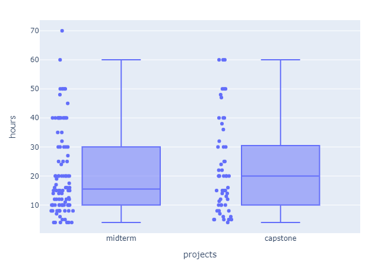

# Building Machine Learning Zoomcamp course statistics with Plotly library

## Introduction
As you may have noticed, during filling out Google forms to submit homework answers, all users were kindly asked 
to additionally fill in the fields related to the amount of time they spent on watching lectures, doing homework 
and projects, as well as making projects reviews. All this data was collected during the course and then provided 
by [Alexey Grigorev](https://github.com/alexeygrigorev) for analysis (of course, after hashing sensitive data). 
So, everyone was felt free to use it to make some research (and still can, I'm sure). That’s what I decided to do.

## Table of contents
<!--ts-->
   * [Dataset](#dataset)
   * [Tools](#tools)
   * [Plotly](#plotly)
   * [Workflow](#workflow)
      * [User data](#user-data)
      * [Time spent data](#time-spent-data)
      * [Submissions](#submissions)
      * [Passed assignments](#passed-assignments)
      * [Time spent](#time-spent)
   * [Conclusion](#conclusion)
<!--te-->

<a id='dataset'></a>
## Dataset
The dataset itself consists of two files:
* [roles.csv](data/roles.csv) – a small one that contains columns such as user emails and their occupation;
* [time_spent.csv](data/time_spent.csv) – a big one with information about assignment statistics: the amount of 
time spent by users on each lecture, homework or projects.

The idea was simple:
* to load and process the raw data;
* calculate key course statistics and plot the diagrams according to these results.

<a id='tools'></a>
## Tools
I decided to take the following main tools for doing that:
1.	[Pandas](https://pandas.pydata.org/) – a standard Python library for reading and processing tabular data.
2.	[Regular expressions](https://docs.python.org/3/library/re.html) – to find and process specific patterns in the dataset.
3.	[Plotly](https://plotly.com/python/getting-started/#overview) – powerful tool to build amazing and functional visualizations.

<a id='plotly'></a>
## Plotly
If you ask python developers which library should be used for data visualization, the most popular option will be 
Matplotlib. We should understand that Matplotlib was created a several years ago, before Data Science became one of 
the most rapidly increasing fields, and it was more focused on displaying NumPy arrays. At the same time, the most 
common type of objects that we need to handle in Data Science are DataFrames and Series of data. And of course, 
during this time, a lot of powerful tools for data visualization have appeared. A good example of such kind of 
a library is Plotly.

Plotly is an interactive open-source plotting library that built on top of the Plotly JavaScript library 
([plotly.js](https://plotly.com/javascript/)). It supports over 40 unique chart types covering a wide range of 
statistical, financial, geographic, scientific, and 3-dimensional use-cases. Colorful interactive diagrams that 
can be displayed in Jupyter notebooks in a couple of code lines? Or beautiful visualizations with various controls 
embedded into your web app? No problem, it’s ease with Plotly! [Here](https://plotly.com/python/getting-started/#overview) you can read more about Plotly.

Plotly could be installed using `pip`:
```bash
pip install plotly==5.5.0
```
or `conda`:
```
conda install -c plotly plotly=5.5.0
```
To getting start using it, just write the following line:
```python
import plotly.express as px
```

<a id='workflow'></a>
## Workflow

<a id='user-data'></a>
### User data
I started my workflow from the dataset loading. To be exact, I loaded [roles.csv](data/roles.csv) file using pandas 
function `read_csv`.
```python
email_df = pd.read_csv(os.path.join(DATA_DIR, 'roles.csv'))
```
<p align='center'></p>

The initial dataset contained only two columns:
* `email` – represents the hashed user email and can be used as an Id;
* `role` – a categorical feature that describes user’s occupation.
A brief analysis showed that the dataset has only 5 blank instances in the `role` column. I just filled in these empty 
fields with the `Other` value and looked at the distribution of user roles.
```python
email_df['role'].fillna('Other', inplace=True)
roles_df = email_df.groupby('role').count().reset_index().rename(columns={'email': 'count'})
```
<p align='center'></p>

To illustrate numerical proportion, I plotted the results using [Pie Chart](https://plotly.com/python/pie-charts/).
```python
fig = px.pie(roles_df, values='count', names='role', width=700, height=400)
```
<p align='center'></p>

Students have become the most popular category of course participants.

<a id='time-spent-data'></a>
### Time spent data
The next file – [time_spent.csv](data/time_spent.csv) – contained information about the total amount of time the user 
spent on the course activities and included the following columns:
* `email` – hashed user email;
* `time_lectures` – the time that the user spent on watching video materials of the course (lectures);
* `time_homework` – the amount of time that the user spent on practice (doing homework, as well as projects, making reviews);
* `what` – assignment name.

<p align='center'></p>

It seemed to me that the following interesting insights can be extracted from this table:
1.	Total amount of submissions according to each assignment.
2.	The number of assignments passed by users.
3.	And the most interesting part, I guess – how many hours users spent on assignments during the course.

<a id='submissions'></a>
### Submissions
I selected pandas method `value_counts()` to calculate the submissions number for each assignment.
```python
submission_df = time_spent_df['what'].value_counts().reset_index() \
    .rename(columns={'index': 'assignment', 'what': 'submissions'})
```
And then plotted it with [Bar Chart from Plotly](https://plotly.com/python/bar-charts/).
```python
fig = px.bar(submission_df, x='assignment', y='submissions', text_auto='3s', width=800, height=600)
fig.update_traces(textfont_size=12, textangle=0, textposition='outside', cliponaxis=False)
```
<p align='center'></p>

Yes, as expected, the first homework has the largest number of unique submissions, while the last one wasn’t so popular.

<a id='passed-assignments'></a>
### Passed assignments
I also decided to group data according to the `email` column and calculate the number of assignments passed by each user.
```python
users_df = time_spent_df.groupby('email').count()['what'].value_counts() \
    .reset_index().rename(columns={'index': 'completed_assignments', 'what': 'exact'}) \
    .sort_values(by='completed_assignments').reset_index(drop=True)
users_df['at_least'] = users_df.loc[::-1, 'exact'].cumsum()[::-1]
```
Here we have two columns:
* `exact` – represents users who have successfully passed the exact number of assignments;
* `at_least` – also considers users who have submitted more tasks (than exact).

To plot the data, I also used Bar Chart.
```python
fig = px.bar(
    users_df, 
    x='completed_assignments',
    y=['exact', 'at_least'],
    text_auto='3s',
    barmode='group',
    width=1000,
    height=500
)

fig.update_traces(textfont_size=12, textangle=0, textposition="outside", cliponaxis=False)
fig.update_xaxes(dtick=1)
fig.update_layout(xaxis_title='completed assignments', yaxis_title='users', legend_title='users done')
```


Short observations:
* 443 users completed at least one task;
* 172 users among them submitted just one assignment, while 34 went through all 13 tasks.
Finally, I decided to move on to the trickiest part – estimating the time that users spent watching lectures, doing 
homework and projects.

<a id='time-spent'></a>
### Time spent
Why this part was the trickiest one? Because the key columns `time_lectures` and `time_homework` contained data in 
different formats. People filled in these text fields in the Google form in various ways, using:
* integer values;
* float values with point/comma as delimiter;
* time intervals;
* short/long text descriptions;
* combined formats.

Moreover, some people:
* just left these fields blank (`NaN`);
* specified spent time not only in hours, but also in minutes, days and even in weeks!
* applied different abbreviations for times (like ‘h’, ‘hr’, ‘hrs’ for ‘hours’).

Therefore, there was need to deal with it somehow: to extract the useful information in unified format, e.g. in single 
hour value.

There are many approaches, like language models or other techniques, to extract the necessary information. But in this 
particular case, I went with regular expressions and word mappings because the dataset wasn't so huge.

So, I prepared a pipeline for processing `time_lectures` and `time_homework` columns that consisted of:
1.	A function that parses and processes column expressions according to the list of word mappings.
```python
def process_text(text: str, words: dict) -> str:
    if pd.isna(text):
        return text
    
    text = text.replace(',', '.') # replace decimal delimiter from comma to point
    text = text.replace('/', '-') # replace interval sign from backslash to dash
    text = text.replace(':', '-')    
    
    text = re.sub('(\d+(\.\d+)?)', r' \1 ', text)
    regex = r'\b(?:' + '|'.join(re.escape(word) for word in words) + r')\b'
    reobj = re.compile(regex, re.I)
    
    return reobj.sub(lambda x: words[x.group(0)], text.lower())
```
2.	Manual conversion of time values specified in minutes, days or weeks to the hour format.
3.	A function for extracting numeric values from the text descriptions using regular expressions. 
```python
def extract_numbers(text: str) -> str:
    if not pd.isna(text):
        numbers = [float(s) for s in re.findall(r'-?\d+\.?\d*', text)]
    else:
        numbers = []
    if not numbers:  # for NaN values
        hours = 0
    elif len(numbers) == 1:  # for single numbers
        hours = numbers[0]
    else:
        if (numbers[1] - numbers[0] <= 5):  # for intervals
            hours = (numbers[1] + numbers[0]) / 2
        else:
            hours = numbers[0] + numbers[1] / 60 # for hour-min format 

    return hours
```
I divided the initial time spent dataset into separate parts (lectures, homework, projects and reviews) and independently 
applied the above pipeline. The results of using this pipeline in case of lectures data can be seen below.

<p align='center'></p>

Using `hours` column I calculated the key statistics, and then plotted the distribution of hours spent by users using 
[Box Plots](https://plotly.com/python/box-plots/).
```python
fig = px.box(
    lectures_time_df[(lectures_time_df.hours > 0) & (lectures_time_df.hours < 30)], 
    x='assignment', 
    y='hours', 
    points='outliers', 
    width=1000, 
    height=600
)

fig.update_layout(xaxis_title='lectures')
fig.show()
```


I used the same pipeline for homework, projects and reviews dataframes, and built the diagrams for them as well.


<p align='center'>
    
    
</p>

<a id='conclusion'></a>
## Conclusion
In conclusion, I would like to post the key results that I obtained during the data analysis.
1. Users spent an average of 3 hours for each lecture and 2 hours for homework.
2. The most time-consuming lectures were on [week-2 (regression)](https://github.com/alexeygrigorev/mlbookcamp-code/tree/master/course-zoomcamp/02-regression) 
and [week-8 (deep learning)](https://github.com/alexeygrigorev/mlbookcamp-code/tree/master/course-zoomcamp/08-deep-learning).
3. The easiest homework in terms of time spent were on [week-1 (intro)](https://github.com/alexeygrigorev/mlbookcamp-code/blob/master/course-zoomcamp/01-intro/homework.md) 
and [week-10 (kubernetes)](https://github.com/alexeygrigorev/mlbookcamp-code/blob/master/course-zoomcamp/10-kubernetes/homework.md).
4. 123 unique users submitted the midterm project, 71 – the capstone project, while 66 – executed both.
5. Users spent a slightly less time on doing and reviewing midterm projects than on capstone.

If you would like to go through all these steps of the workflow and reproduce the results, [here](https://nbviewer.org/github/SVizor42/ML_Zoomcamp/blob/master/ml-zoomcamp-stats/ml-zoomcamp-stats.ipynb) 
you can find the original notebook.
